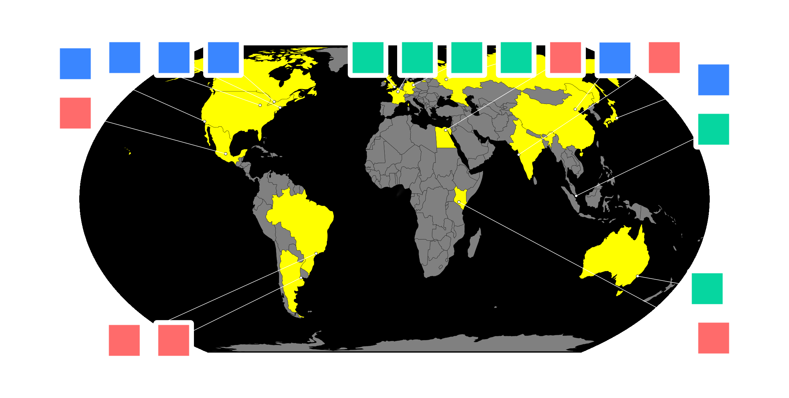

# TamboMap

A Julia package for rendering scientific collaboration maps. Countries with participating
institutions are highlighted, and institution logos are placed around the map with connector
lines to their geographic locations.



## Installation

Clone the repository and activate the project environment:

```
git clone https://github.com/jlazar17/TamboMap.git
cd TamboMap
julia --project=. -e 'using Pkg; Pkg.instantiate()'
```

## Quick start

### Map without logos

```julia
using Pkg; Pkg.activate(".")
using TamboMap
using CairoMakie: save

institutions = TamboMap.institutions_from_json("institutions/")
fig = make_map(institutions)
save("map.png", fig)
```

### Map with logos (self-contained example)

The `examples/run_logo_map.jl` script generates placeholder logos and renders a
full logo map with synthetic institutions. It requires no network access or external data:

```
julia --project=. examples/run_logo_map.jl
```

### Map with logos (RevTeX workflow)

If you have a RevTeX author file, the geocode cache included in this repository means
affiliations are resolved instantly without any network calls:

```julia
using Pkg; Pkg.activate(".")
using TamboMap
using CairoMakie: save

institutions = institutions_from_revtex("authors.tex"; cache_dir="geocode_cache")
fig = make_map_with_logos(institutions; cache_dir="logo_cache")
save("map.png", fig; px_per_unit=2)
```

Only institutions that have a `logo_path` or `logo_url` field set will have logos shown.
The rest appear as dots.

## Defining institutions

### From JSON files

Each institution is a JSON file in a directory. Example (`institutions/harvard_university.json`):

```json
{
  "name": "Harvard University",
  "location": {
    "country": "United States of America",
    "city": "Cambridge",
    "latitude": 42.3736,
    "longitude": -71.1097
  },
  "logo_url": "https://example.com/harvard_logo.png"
}
```

The `logo_path` and `logo_url` fields are optional. Load a directory of JSON files with:

```julia
institutions = TamboMap.institutions_from_json("institutions/")
```

### From a RevTeX author file

If your collaboration uses a RevTeX `.tex` file listing `\affiliation{...}` entries, you
can geocode all affiliations automatically:

```julia
institutions = institutions_from_revtex("authors.tex"; cache_dir="geocode_cache")
```

This parses affiliations, queries the [Nominatim](https://nominatim.openstreetmap.org/)
geocoding API (no API key required), and caches results under `cache_dir`. Subsequent runs
use the cache and do not hit the network.

### Adding logos after geocoding

Once an affiliation is geocoded, attach a logo URL or local file path:

```julia
TamboMap.set_logo_url!("Harvard University, Cambridge, MA", "https://example.com/logo.png")
TamboMap.set_logo_path!("Harvard University, Cambridge, MA", "/path/to/logo.png")
```

## Build script (RevTeX workflow)

The script `scripts/build_logo_map.jl` automates the full pipeline — parse, geocode,
optionally prompt for logos, and render:

```
# Render immediately using whatever logos are already cached:
julia --project=. scripts/build_logo_map.jl authors.tex output.png

# Prompt for logos on institutions that have none:
julia --project=. scripts/build_logo_map.jl --ask-new authors.tex output.png

# Prompt for logos on every institution (to update existing entries):
julia --project=. scripts/build_logo_map.jl --ask-all authors.tex output.png
```

When prompted, enter a URL (`https://...`) or an absolute/relative file path. Press Enter
to skip.

## make_map options

```julia
make_map(
    institutions;
    ocean_color        = :black,
    country_color_yes  = :yellow,   # countries with institutions
    country_color_no   = :grey,     # countries without institutions
    scatter_color      = nothing,   # defaults to country_color_no
)
```

## make_map_with_logos options

```julia
make_map_with_logos(
    institutions;
    ocean_color        = :black,
    country_color_yes  = :yellow,
    country_color_no   = :grey,
    scatter_color      = nothing,
    logo_scale         = 15.0,      # logo height in ax2 data units
    logo_gap           = 5.0,       # minimum gap between logos
    box_gap            = 15.0,      # minimum gap between logos and map boundary
    spring_k           = 0.5,       # spring force pulling logos toward anchors
    repulse_k          = 500.0,     # repulsion force between logos
    boundary_k         = 100.0,     # force pushing logos outside the map
    n_iter             = 500,       # layout iterations
    line_color         = :white,
    line_width         = 0.8,
    logo_background    = :white,
    logo_padding       = 3.0,       # padding inside the logo box
    logo_corner_radius = 4.0,
    box_strokecolor    = :black,
    box_strokewidth    = 0.0,
    cache_dir          = "logo_cache",
)
```

Logo placement uses a force-directed algorithm. If logos overlap, try increasing
`repulse_k` or `n_iter`. If logos crowd the map edge, increase `box_gap`.

## Example

`examples/run_logo_map.jl` shows a self-contained example using synthetic institutions
with placeholder logos. Run it with:

```
julia --project=. examples/run_logo_map.jl
```

Output is saved to `examples/logo_map.png`.

## Dependencies

- [CairoMakie](https://docs.makie.org/stable/) — rendering
- [GeoMakie](https://geo.makie.org/) — geographic projection (EqualEarth)
- [FileIO](https://github.com/JuliaIO/FileIO.jl) / [ImageIO](https://github.com/JuliaIO/ImageIO.jl) — image loading
- [Downloads](https://github.com/JuliaLang/Downloads.jl) — logo fetching from URLs
- [JSON](https://github.com/JuliaIO/JSON.jl) — institution file parsing
- [Glob](https://github.com/vtjnash/Glob.jl) — directory scanning
